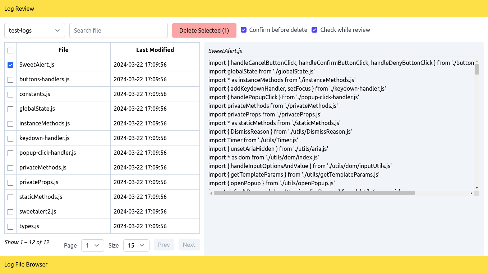

# Log Review

Review files in browser.



## Features

- Simple
- Clean look (using [Tailwindcss](https://tailwindcss.com))
- Reactive (with [Preactjs](https://preactjs.com))

## Installation

- Download bundle (zip/tar) or use `git clone https://github.com/eghojansu/log-review.git`
- Copy `config.ini.example` as `config.ini`, do your configuration
- Start with local php server
  `php -S localhost:8000 -t public`

## Configuration

Set your directories in `directories` section of `config.ini`.

```ini
[directories]
first-directory=/your/real/path/to/review
second-directory=/your/real/path/to/second-review,with,any,file,extensions
```

Any text after your directory will treated as file extensions to be listed for review.

## Disclaimer

> This script will remove your file permanently.
>
> **_Please use with cautions._**
>
> In case script has no access to write file/directory, it simply ignore the deletion.
